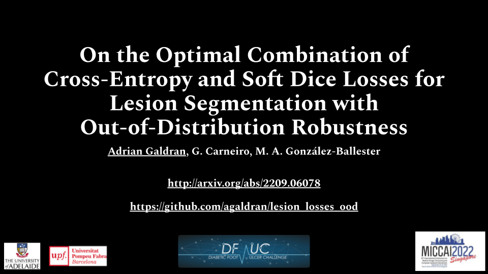

# On the Optimal Combination of BCE and Dice Losses for Lesion Segmentation with OoD Robustness
You have reached the repository holding the code to reproduce results in the paper:

```
A Study on the Optimal Combination of the Cross-Entropy and Dice Losses for Lesion Segmentation with Out-of-Distribution Data 
Adrian Galdran, Gustavo Carneiro, and Miguel A. González Ballester
DFU Challenge Proceedings, part of MICCAI 2022
```
The paper is in arXiv, you can get it at this [link](http://arxiv.org/abs/2209.06078).

## What's the deal? Quick Explanation
We used this code to train models on datasets of images **always containing lesions**, and then test those models on images that contain lesions (in-distribution) and **also lesion-free images** (Out-of-Distribution, OoD).
We consider the latter as a problem of robustness to OoD data *at the image-level*, since the model is not used to see this sort of images. 
It's funny because at the pixel level, individual pixels are all in-distribution (background) even when there is no lesion, but as a whole, images without lesions can be considered as OoD (I guess).

I forgot, we wanted to know if BCE, Dice, or some flavors of combinations of these two, were better suited for this task than others, so the code allows you to play with that.

## Video Presentation
You can also watch a short video of me presenting this work at the DFUC 2022 - MICCAI workshop, it's probably the quickest way to get an idea of what this is about. 
Just click in the image below:

<a href="https://www.youtube.com/">
<p align="center">

</p>
</a>


## Dependencies
You want to install the usual, `pytorch`, `torchvision`, `scikit-learn`, `scikit-image`, `tqdm`, `pandas`, `jupyter`. 
Also, the architectures I use belong to the [pytorch-segmentation-models](https://github.com/qubvel/segmentation_models.pytorch) library, which can be installed via `pip install segmentation-models-pytorch`.   
## Data availability
About data. DFUC did not release data publicly, you need to head to [grand-challenge](https://dfuc2022.grand-challenge.org/), 
where you will be able to download the training data. 
Validation and test data, I don't think they published those, so you will need to make a submission to see performance. 

Alternatively, what you can do is run experiments on the publicly available [Endotect 2021](https://endotect.com/) dataset. 
Automatic downloading of the training data can be triggered by running:
```
sh get_train_endo_data.sh
```
That script will also put everything in place and ready to train.
The test set with in-distribution and OoD data is already in this repository, in `data_endotect` directory.
You will also find a useful `readme` file [there](github.com), explaining how I arranged the data.

Without further ado, let's see how to use the code. 

## Running experiments - Training
It's as (relatively) simple as this:
```
python train_losses.py --mixture combo --loss1 ce --loss2 dice --csv_train data_endotect/train_f1.csv --save_path endotect/mobilenet_only_ce_f1 --model_name fpnet_mobilenet_W
```
Parameter `--mixture` controls which kind of loss combination you employ during training, options being:

- ``only_loss1``: minimize only the first loss (in the above call, cross-entropy)
- ``combo``: minimize the sum of the first and the second loss (in the above call, cross-entropy+dice)
- ``linear``: minimize a linear combination of `loss1` and `loss2`, from `1*loss1+0*loss2` in the first epoch up to `0*loss1+1*loss2` in the last epoch.
- `fine_tune_loss2`: minimize `loss1` for the first 90% epochs, and the switch to `loss2`.

We only experiment with `ce` and `dice` for the losses, but the code also has a few other loss functions implemented.

Then, parameter `--csv_train` allows you to train in different folds of the training data, it works as you expect. 
You also need to choose which architecture to use and where to save the results, the other parameters are pretty self-explanatory, check the code to see how they work. 

By the way, model architectures are defined in `models/get_model.py`, they follow my previous work [here](https://arxiv.org/abs/2110.01939).

If you want to take a look, there is a very ugly bash script called `train_resnet18_endo.sh` that contains a bunch of calls to the code. 
Those would end up training the five folds with all the loss combinations we analyzed in the paper, using a `resnet18` architecture.

## Running experiments - Testing
Once a model has been trained (in a multi-fold manner), you can analyze results using `jupyter notebook`. 
This is because I did not have time to put it all into a `python` file, but hey, you are getting this for free so...

For example if you have already called `sh train_resnet18_endo.sh` and waited a bit for the five-fold training to finish[^1], you could now use `test_polyps.ipynb` to check performance. 
There you will be able to generate segmentations and compute Dice scores with aggregated statistics, for in and out-of-distribution data.

[^1]: In my machine a model trains in 3+1/2 minutes, and this trains 25 models